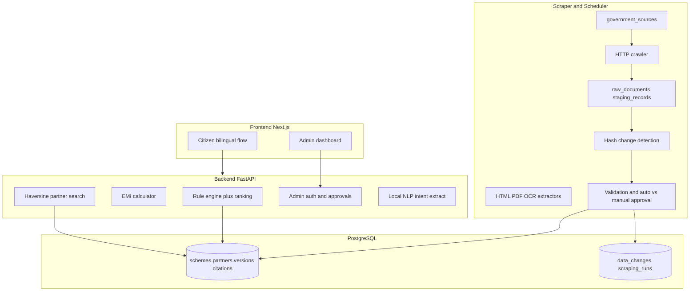

# Architecture

```mermaid
flowchart TB
  subgraph ui [Frontend Next.js]
    CitizenFlow[Citizen bilingual flow]
    AdminDash[Admin dashboard]
  end

  subgraph api [Backend FastAPI]
    Reco[Rule engine plus ranking]
    Calc[EMI calculator]
    PartnerSearch[Haversine partner search]
    AdminAPI[Admin auth and approvals]
    NLP[Local NLP intent extract]
  end

  subgraph ingest [Scraper and Scheduler]
    Registry[government_sources]
    Crawler[HTTP crawler]
    ChangeDetect[Hash change detection]
    Parser[HTML PDF OCR extractors]
    Staging[raw_documents staging_records]
    Validator[Validation and auto vs manual approval]
  end

  subgraph data [PostgreSQL]
    Prod[(schemes partners versions citations)]
    Audit[(data_changes scraping_runs)]
  end

  CitizenFlow --> api
  AdminDash --> AdminAPI
  Registry --> Crawler --> Staging --> ChangeDetect --> Validator --> Prod
  Validator --> Audit
  Reco --> Prod
  PartnerSearch --> Prod
```

See [README.md](../README.md) for full documentation.
